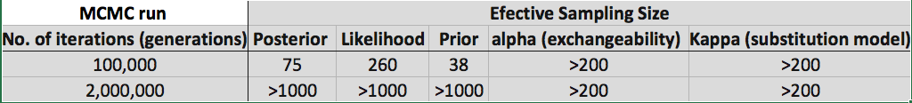
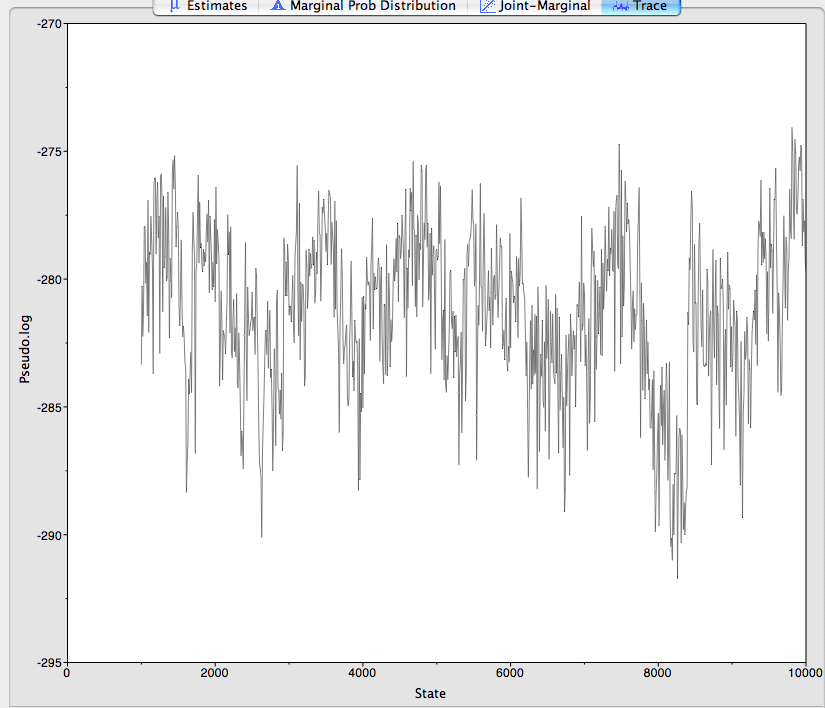
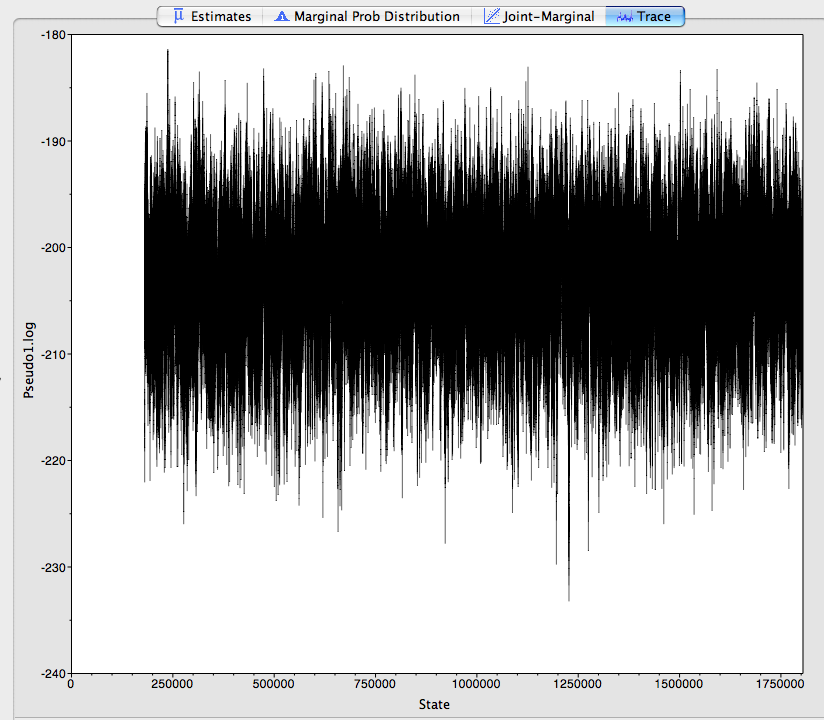

Final Assingment Using RevBayes
===============================

Methods: 
========
The phylogenetics relationships of a genus Pseudoxiphophorus (Poecilinae:Poeciliidae) was infer using a bayesian approach 
using the software RevBayes using a data set of 1 mitochondrial gene and 5 nuclear loci: 2 exons
and 3 introns, under concatenation of multiple genes. assuming the same substitution model (HKY) for all 
the loci under study, even if this assumption is not biologically realistic, we can compare the results of this approach analyzing this dataset
under other models and in a partition scheme later on. 

We visually inspects two different runs, one that only ran for 100,000 iterations (generations) and one that run for 2,000,000 iterations (generations) 
the performance of the runs, were visually assessed using the software tracer and the topology are recovered with a maximum a posteriori tree (MAP tree)
representation of the distribution of trees generated during the MCMCM run. 

A script of the analysis is provided in 
For the script of this analysis a template was obtain from the RevBayes repository (http://revbayes.github.io/tutorials.html)
for the MCMC analysis of 2,000,000 generations, 2 independent runs were set up, but a error in the way the script was set up: 
see line 161, were the number of runs (nruns=2) was not passed as an argument of the function mymcmc (........) which lead to that the analysis 
only realize one single run. this mistake did not allow me to check for convergence of the parameters and topology for the present analysis.   
 
 
Results: 
=========
For the MCMC run in RevBayes with 100,000 iterations(generations), effective sampling size for posterior and prior did not mix properly (see figure 1, table 1) 
for the longer run 2,000,000 iterations(generations) all parameters mix well and effective sample size is higher than the cutoff of 200 (see figure 2 and table 1). convergence of results  in independent runs could not be evaluated do the 
error in the RevBayes script. but posterior independent runs will be performed to asses convergence not only of the MCMC run but as well convergence of parameters space sampled and effective sampling size 
of independent runs. 

**Table 1 Effective sampling size of two independent runs of different length of iterations**

**Figure 1 Trace file of MCMC run of 100,000 iterations**

**Figure 2 Trace file of MCMC run of 2,000,000 iterations**

Tree topologies recovered among the short (100,000 iterations) and the long (2,000,000 iterations) runs were congruent, and as previous studies cryptic diversity was identify in the most widespread species of the genus
(colored in red), some of the relationships recovered among the lineages in the genus are resolved with low support. To tackle this problem a more robust analysis of this data set including a more rich model that allow to different 
substitution models for each loci, might improve the exploration of parameter space and will allow to have a better understanding of the relationships of the lineages of this genus, as well a different approach like the multispecies coalescent
model, will allow to explore gene tree discordance that can be proposing different set of relationships that can be in conflict. 

**Figure 3 maximum a posteriori (map) tree of the phylogenetic relationships of Pseudoxiphophorus. red clades depict paraphyly of the most wide spread species of the genus, branches in color blue represent bayesian posterior probabilities
< 0.90**
 

